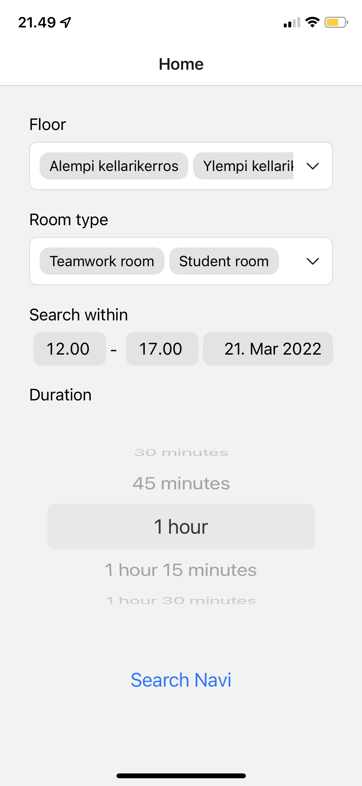
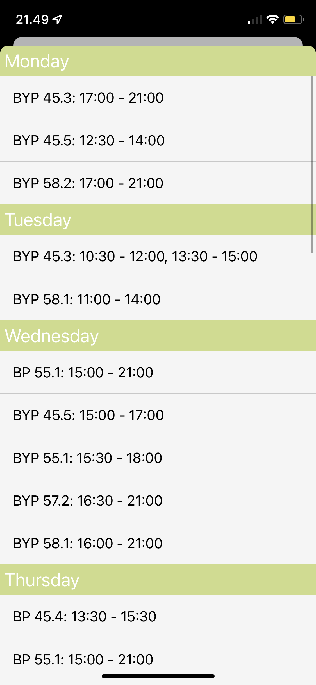

#  Navitron

An easy way to find available meeting rooms in the university of Jyväskylä campus.

<p float="left">
    
    
</p>

## Run

```bash
git clone git@github.com:jererobles/navitron.git
cd navitron
yarn
expo web
```

## TODO

-   [x] iOS app
-   [ ] Android app
-   [ ] Web app
-   [ ] Support for buildings other than the library
-   [ ] Broken things that are a PITA to accomplish in ReactNative in 2022
-   Dark mode support
-   Modal screen has inconsistent height
-   Search button should be pill-shaped
